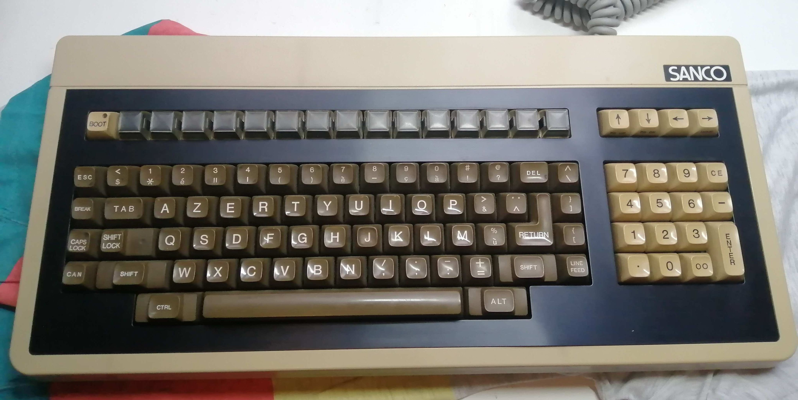
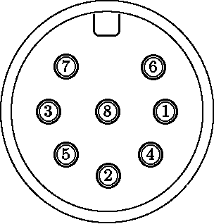
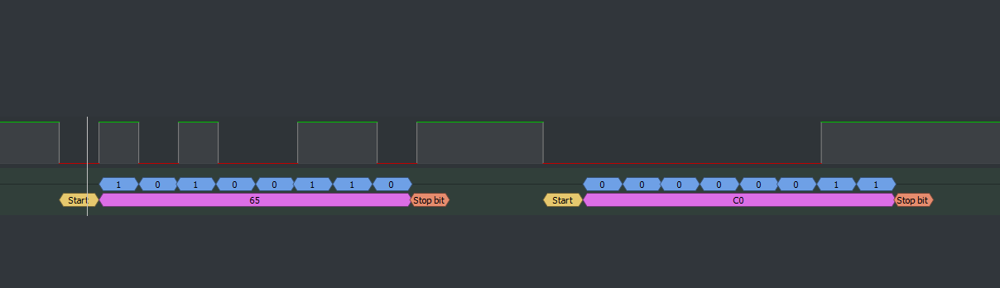
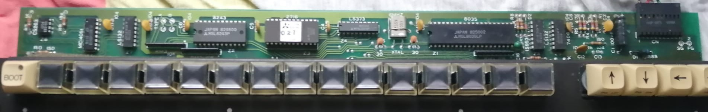
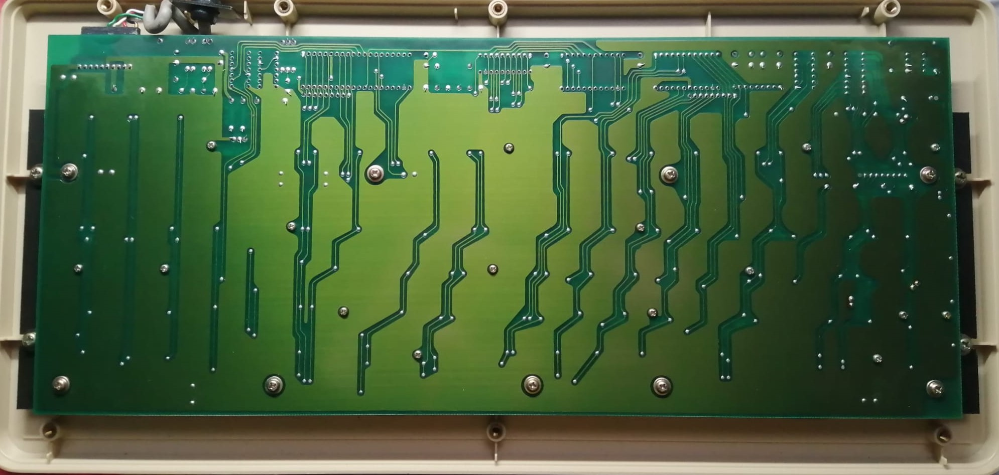
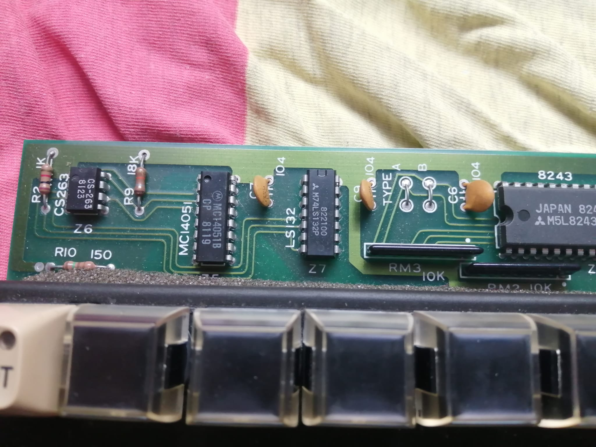
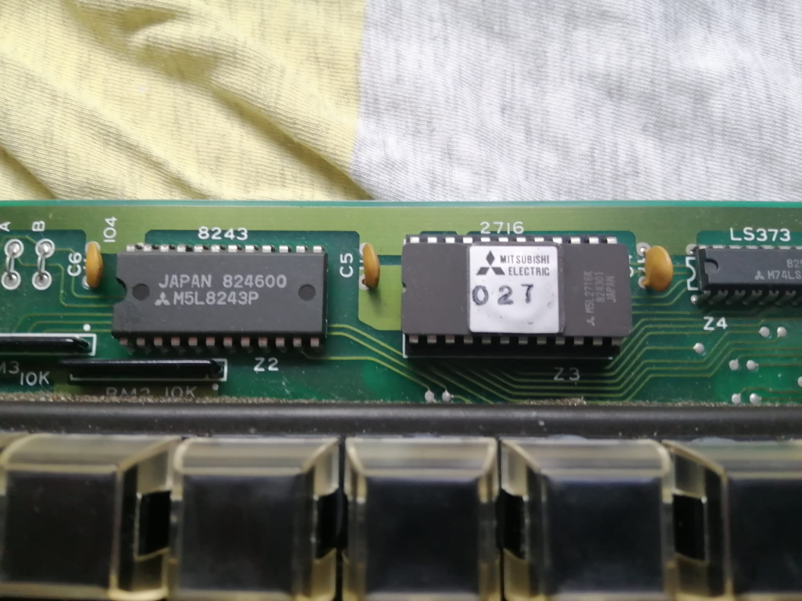
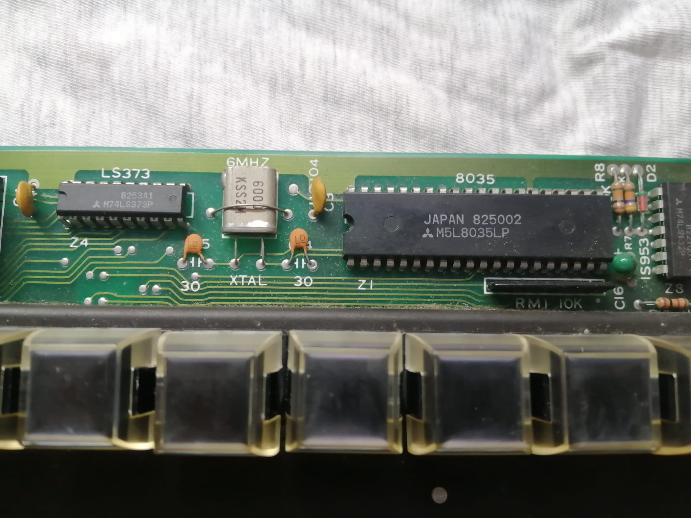
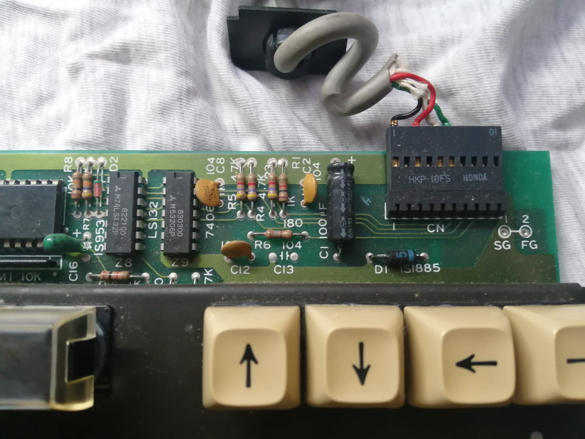

# 
   KEYBOARD 

  

- [CONNECTOR](#connector)
    - PINOUT
- [PROTOCOL](#protocol)
  - DESCRIPTION
  - KEY MAP
- [PCB](#pcb)
    - EPROM DUMP
    - IMAGES

## Connector

The keyboard uses an 8pin DIN connector with the following configuration :

  

> The cable field refers to the cable that connects to the pcb 

Pinout of the **male** connector:
| Pin | Cable | Usage |
|:---:|:-----:|:-----:|
| 3   | Green | Transmit |
| 6   | Red   | Vcc(5V) |
| 8   | White,Black | GND

The other pins are unused.

## Protocol

The keyboard uses the TRANSMIT pin to send data over to the computer. The TRANSMIT pin uses TTL voltages (5V/0V).

Two bytes of data are sent everytime a key is pressed. The first one represent the key that was pressed and the second one contains flag for CTRL,ALT,CAPS and SHIFT.

:warning: The decoder used to interpret the data may be wrong you can use the [saved pulseview capture](./SIGNALS/) for further analysis. :warning:

The signal was interpreted using a UART decoder at 1200 baud with lsb-first, one stop bit and no parity bit. The key codes are reported accordingly.

### Signal example

### Observations:
- The time between the first stop bit and the start bit is around ~2ms (May be interpreted as 3 stop bits (?))
- As far as I know the last 4 bits of the second byte are always the same.

### CONTROL BYTE

Bits in sending order

S C A R 0 0 1 1

| Flag | Meaning |
|:-:|:-:
S| SHIFT 
C| CAPS 
A| ALT 
R| CTRL 

When the corresponding flag is set to 1 it's considered active

### KEY MAP

Here is reported the KEY mapping as interpreted with the previously mentioned decoder. The keys are listed by row from left to right. Note that the keypad and arrows are seprarated from the rows

#### Function keys:

| KEY | CODE |
|:-:|:-:|
BOOT | 4D
F1 |  4E
F2 |  4F
F3 |  50
F4 |  51
F5 |  52
F6 |  53
F7 |  54
F8 |  55
F9 |  56
F10 |  57
F11 |  58
F12 |  59
F13 |  5A
F14 |  5B
F15 |  5C

#### First row:

| KEY | CODE |
|:-:|:-:|
ESC |  01
< |  02
1 |  03
2 |  04
3 |  05
4 |  06
5 |  07
6 |  08
7 |  09
8 |  0A
9 |  0B
0 |  0C
\# |  0D
@ |  0E
DEL |  0F
^ |  10

#### Second row:

| KEY | CODE |
|:-:|:-:|
BREAK |  11
TAB |  12
A |  13
Z |  14
E |  15
R |  16
T |  17
Y |  18
U |  19
I |  1A
O |  1B
P |  1C
\> |  1D
. . |  1E
} |  1F

#### Third row:

| KEY | CODE |
|:-:|:-:|
CAPS-LOCK | 60
SHIFT-LOCK | 65
Q |  20
S |  21
D |  22
F |  23
G |  24
H |  25
J |  26
K |  27
L |  28
M |  29
% |  2A
ENTER |  2B
{ |  2C

#### Fifth row:

| KEY | CODE |
|:-:|:-:|
CAN |  2D
LEFT-SHIFT |  63
RIGHT-SHIFT | 64
W |  2E
X |  2F
C |  30
V |  31
B |  32
N |  33
/ |  34
. |  35
\- |  36
\+ |  37
LINE_FEED |  38

#### Sixth row:

| KEY | CODE |
|:-:|:-:|
CTRL | 61
SPACE | 39
ALT | 62

#### Arrows:

| KEY | CODE |
|:-:|:-:|
UP | 3A
DOWN | 3B
LEFT | 3C 
RIGHT | 3D

#### Keypad:

| KEY | CODE |
|:-:|:-:|
7 |  3E
8 |  3F
9 |  40
CE |  41
4 |  42
5 |  43
6 |  44
\- |  45
1 |  46
2 |  47
3 |  48
. |  49
0 |  4A
00 |  4B
ENTER |  4C

## PCB

The dump of the EPROM can be found [here](./EPROM_DUMPS/KB_EPROM.bin).

### FRONT

### BACK

### Closeup images (left to right): 

